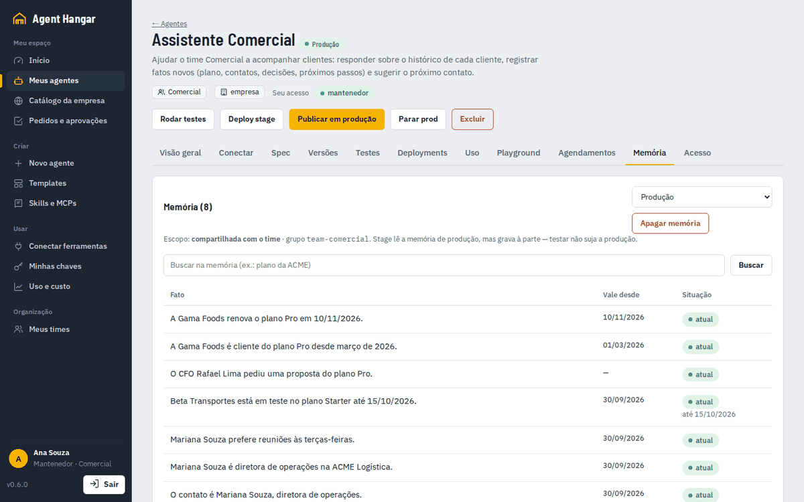
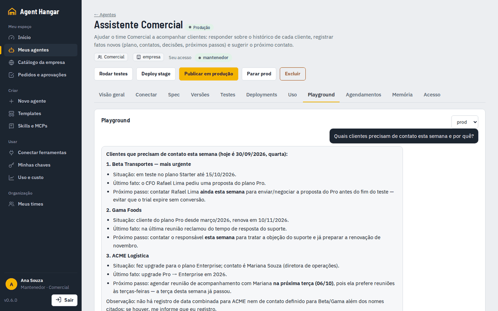
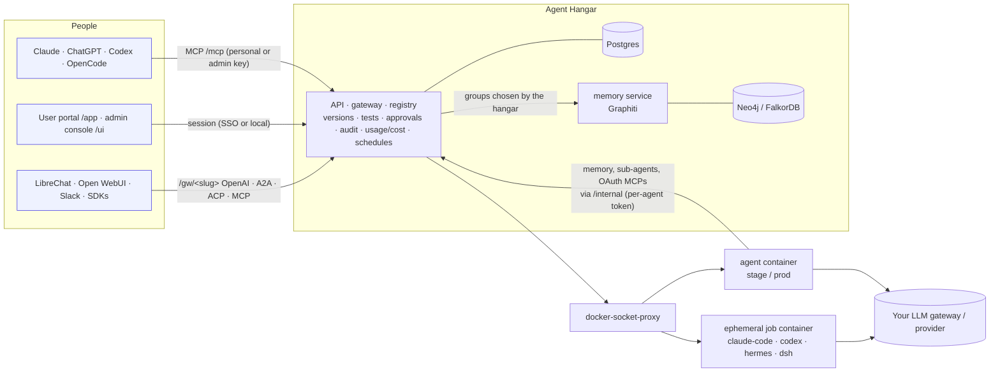
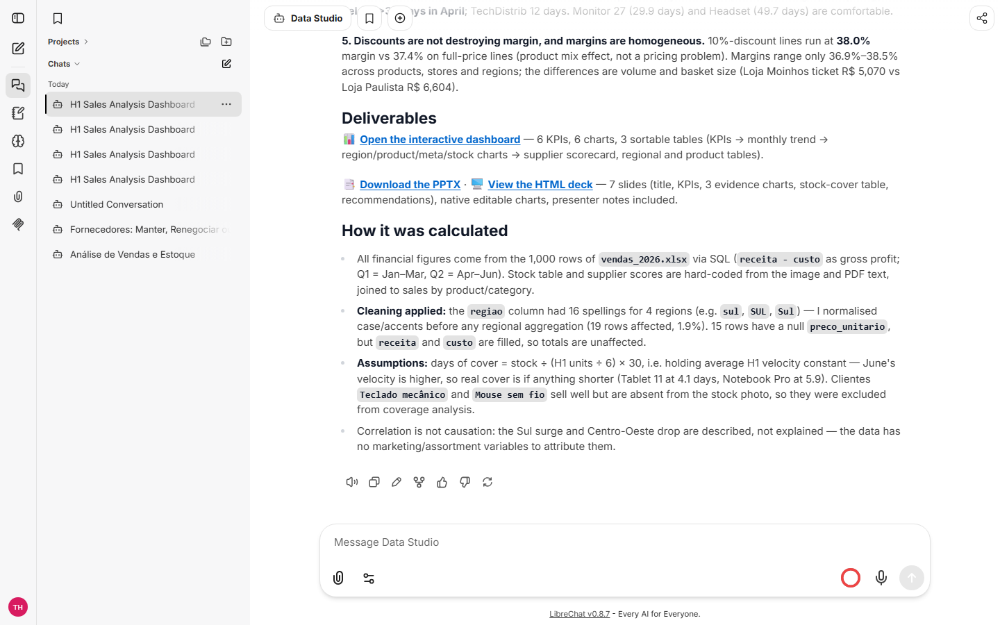
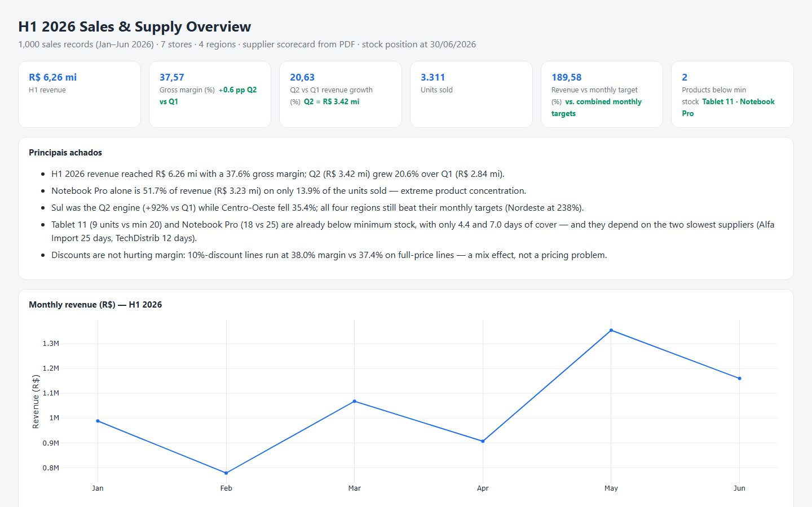
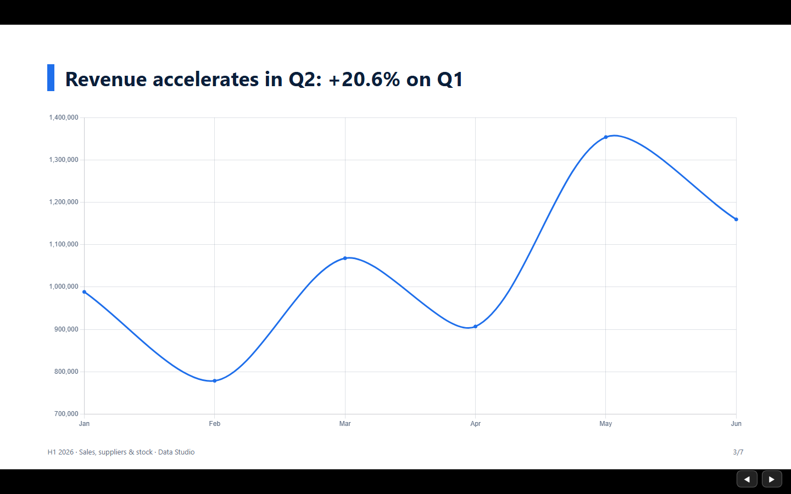

<div align="center">

# ⌂ Agent Hangar

**The self-hosted control plane for your company's AI agents.**

Ask Claude, ChatGPT, Codex or OpenCode for an agent. The hangar builds it, tests it in stage and ships it to its
own container. Then everyone uses it from a portal, a chat UI or any tool, over **OpenAI-compatible, A2A, ACP and
MCP**.

[](https://github.com/valteresj2/agent-hangar/actions/workflows/ci.yml)
[](LICENSE)
[](https://github.com/valteresj2/agent-hangar/releases)


[Example](#from-a-request-in-claude-to-a-working-agent) · [Install](#installation) · [Features](#features) ·
[How it works](#how-it-works) · [Docs](#documentation) · [Roadmap](ROADMAP.md) · [Português](README.pt-BR.md)

</div>

<p align="center"></p>
<p align="center"><sub>The user portal, recorded on a local install · <a href="docs/assets/portal-tour.mp4">MP4 version</a></sub></p>

> **Status: alpha (v0.11).** It works end to end and is covered by tests, but APIs may still change. Run it inside
> your network until you have read [docs/security.md](docs/security.md).

---

## From a request in Claude to a working agent

A real run on a local install. Ana is a regular user: she maintains the *Comercial* (sales) team and is **not** an
admin. She connected Claude to the hangar's MCP server with her personal token.

**1. She asks.**

> *"Sou a Ana, do time Comercial. Crie no Agent Hangar um agente chamado “Assistente Comercial” para o nosso time
> acompanhar clientes (…). Use a conexão openrouter-deepseek, dê memória compartilhada com o time, inclua testes,
> publique em produção e agende para todo dia útil às 8h um resumo dos clientes com os próximos passos."*
>
> (It translates to: create a sales assistant that tracks clients, give it team memory, add tests, publish it, and
> schedule a daily summary with next steps for weekdays at 8am.)

**2. Claude builds it through the hangar's MCP tools.** The hangar's instructions tell the model which steps to
take and in what order. Ana's permissions apply to every call.

| Step | MCP tool | What happened |
|---|---|---|
| Who am I? | `whoami` | Ana Souza, maintainer of *Comercial* |
| What can I reuse? | `list_catalog` | The `openrouter-deepseek` LLM connection |
| Register | `register_agent` | `assistente-comercial`, owned by *Comercial* |
| Design | `design_agent` | Instructions, LLM, `memory: {scope: team}` and 3 LLM-as-judge tests (v2) |
| Test and ship | `ship_agent` | Stage, then **9/9 checks passed**, then production (43 s) |
| Schedule | `schedule_agent` | "Daily client summary", weekdays at 08:00 (America/Sao_Paulo) |

<p align="center"></p>

**3. The team uses it.** Ana records the day's news: ACME upgraded to Enterprise; Beta Transportes is on a Starter
trial until 15/10 and its CFO asked for a Pro proposal; Gama Foods renews on 10/11 and complained about support.
The agent writes each item to the **team memory**, a temporal knowledge graph where changed facts keep their
history.

| Her Início page in the portal | Team memory, with dated facts |
|---|---|
|  |  |

**4. The result.** In a new conversation, *"Which clients need contact this week, and why?"* is answered from
memory. At 8am on weekdays, the scheduled run sends the summary on its own:

> **1. Beta Transportes: most urgent.** Starter trial ends on **15/10/2026**; the CFO Rafael Lima asked for a Pro
> proposal. **Next step:** contact **Rafael Lima (CFO) this week, before 15/10**, to present the Pro proposal and
> convert the trial.
> **2. Gama Foods.** Pro since March/2026, **renews on 10/11/2026**; complained about support response times.
> **Next step:** reach out within two weeks to fix the support issue before the renewal (…)

| The Playground answer | The scheduled daily summary (the final result) |
|---|---|
|  |  |

The run was recorded with Claude as the MCP client, with Ana's personal token. The agent's own model is
DeepSeek via OpenRouter. The scripts that reproduce it are in
[scripts/demo/portal-tour](scripts/demo/portal-tour/).

## Installation

A guided installer asks a few questions and does the rest: it writes `.env`, starts the stack, registers and **tests**
your LLM, creates the admin and generates the configuration of your AI tools. Full guide:
[docs/install.md](docs/install.md).

**1. Requirements.** Docker (Desktop or Engine) with Compose 2.20+, and Python 3.10+ to run the installer.

**2. Run the installer.**

```bash
git clone https://github.com/valteresj2/agent-hangar && cd agent-hangar
./scripts/install.sh                                              # Linux, macOS, WSL
# Windows: powershell -ExecutionPolicy Bypass -File scripts\install.ps1
```

**3. Answer seven questions** (each has a sensible default):

| | Choices |
|---|---|
| Images | published (recommended) · build from this checkout |
| Address | local · **Cloudflare Tunnel** · **ngrok** · **Tailscale Funnel** (public HTTPS without opening ports) |
| Admin | username and password (or a generated one) |
| LLM | OpenAI · Anthropic · Azure OpenAI · Gemini · OpenRouter · DeepSeek · corporate gateway (LiteLLM, Portkey…; also the way to Bedrock/Vertex) · Ollama · any OpenAI-compatible endpoint |
| Memory | Neo4j · FalkorDB · none |
| Sign-in | local accounts · Google · Microsoft Entra ID · GitHub · OAuth2 (Okta, Keycloak, Auth0…) |
| Extras and tools | Data Studio, Docker MCP catalog, Activepieces, coding harnesses; code policy; configs for Claude Code, Claude Desktop, Codex, OpenCode, Cursor, VS Code |

**4. Open it.** Go to the address shown at the end (e.g. `http://localhost:8090`) and sign in. Your AI tools'
configuration is in `.hangar/clients/` (start with its `README.md`). Then ask the tool: *"create an agent that…"*.

**5. Check it.** `hangar doctor` checks Docker, the central, each LLM (with a real call), memory, the public address
and TLS, sign-in, MCP and the VS Code extension, and tells you how to fix anything that fails.

To install without questions (automation, VM images), use `./scripts/install.sh --answers setup.yaml`, with
[`setup.example.yaml`](setup.example.yaml) as the model. To change an answer or upgrade, `git pull` and run
`hangar setup` again: previous answers are the defaults and secrets are kept.

### On Kubernetes (GKE, AKS, EKS)

The same installer deploys the Helm chart (`charts/agent-hangar`); agents become Deployments and harness runs become
Jobs, isolated by NetworkPolicies. Full guide: [docs/kubernetes.md](docs/kubernetes.md).

1. **Requirements:** `kubectl` pointing at the cluster, Helm 3.12+, Python 3.10+.
2. **Run** `./scripts/install.sh --target kubernetes` (or `hangar setup --target kubernetes`).
3. **Answer:** cloud (`gke` · `aks` · `eks` · `local`, which picks the preset), namespace, image registry (or your
   mirror), access (**Ingress with TLS** · **Cloudflare Tunnel** · port-forward), Postgres (in the cluster or
   **managed**: Cloud SQL, Azure Database, RDS), then the same admin/LLM/memory/sign-in/tools questions.
4. **Check:** `hangar doctor --namespace agent-hangar`.

For high availability, run 2+ central replicas with a managed Postgres: rolling updates without downtime, and
shared state in the database.

Plain Helm works too: `helm upgrade --install agent-hangar charts/agent-hangar -n agent-hangar --create-namespace
-f charts/agent-hangar/values-gke.yaml -f my-values.yaml`.

<details><summary>Manual install, without the wizard</summary>

```bash
./scripts/setup.sh              # Windows: powershell -File scripts/setup.ps1 (writes .env with random secrets)
docker compose up -d --build    # hangar + Postgres + agent runtime + mock harness
```

Open **http://localhost:8090**, sign in with the `ADMIN_TOKEN` from `.env`, add an LLM under **Provedores de LLM** and
connect your AI client with a personal token from **Minhas chaves**:

```bash
claude mcp add --transport http agent-hangar http://localhost:8090/mcp --header "Authorization: Bearer <key>"
```

Other clients are covered in [docs/clients.md](docs/clients.md).
</details>

### Two web apps

| | Who | What |
|---|---|---|
| **`/app/`**, the user portal | Everyone who is not a platform admin | **Início** (what needs attention, your agents, requests, budget, usage, schedules, connections, memory, what's new), your agents with Playground, Connect, Schedules and Memory, the company catalog, approvals, keys and teams |
| **`/ui/`**, the admin console | Platform admins only | Everything: LLM providers, the MCP catalog, deployments and tests across the company, audit, users, SSO/SCIM |

Everyone signs in on the same page and lands in the right app. Every API call still checks permissions. See
[docs/access.md](docs/access.md#where-each-person-lands).

## Features

**Build where people already work.** The hangar is an MCP server, so Claude, ChatGPT, Codex or OpenCode *are* the
builder. They choose between a chat agent, a coding harness or a multi-agent team from the objective. You can also
start from a template or the UI, and edit a live agent later: `edit_agent` makes a new version, tests it in stage
and publishes it only when you say so. Claude.ai and ChatGPT on the web connect by pasting only the `/mcp` URL: the
person signs in and authorizes (OAuth), with no key to copy.

**Nothing reaches production untested.**
- Every change creates an immutable version.
- Promotion is blocked unless that exact version passed its stage tests: protocol smoke tests,
  `expect_contains`/`regex` and **LLM-as-judge** rubrics.
- Teams can require a second maintainer's approval (four eyes).
- Rollback is one call.

**One container per agent, one per job.**
- Chat agents run in hardened containers: read-only file system, all capabilities dropped, memory/CPU/PID limits.
- Coding harnesses (Claude Code, Codex, Hermes, DeepSeek Harness) run in a **fresh container per call**, which
  returns the result and the `git diff`.

**Coding agents in VS Code.** With the **Agent Hangar extension**, the agents you can use appear in VS Code's chat
model picker. In Agent mode they read, edit and test your project with the editor's own tools, on your machine and
with your approval, while the hangar supplies their instructions, skills, MCPs and memory. Sign-in is one click
through the portal. Cline, Roo Code and Continue work too. See [docs/clients.md](docs/clients.md#vs-code-extension-agent-hangar).

**Every protocol.** Each agent answers on `/v1/chat/completions` (OpenAI-compatible, with streaming), **A2A**
(Agent Card + `message/send`), **ACP** and **MCP**. All of it sits behind one authenticated gateway with
per-channel metrics. The **Connect** tab gives a revocable key per tool and the config to paste.

**Tools for agents.**
- **230+ prebuilt MCP servers** from Docker's official catalog, each in an isolated container
  ([docs/mcp-catalog.md](docs/mcp-catalog.md)).
- **Remote MCPs with OAuth,** such as Activepieces with 280+ business apps, Notion or Linear. They are connected
  once, and the tokens are kept and refreshed by the hangar ([docs/remote-mcp.md](docs/remote-mcp.md)).
- **Data Studio:** Python and DuckDB analysis that produces dashboards and decks.

**Long-term memory.** Add `memory: {scope: agent | team | org}` and the agent remembers customers, decisions and
preferences across conversations ([docs/memory.md](docs/memory.md)).
- The memory is a **temporal knowledge graph** (Graphiti on Neo4j Community or FalkorDB). A fact that changes is
  kept as history, not overwritten.
- The hangar decides which memory each agent reads and writes, and stage never pollutes production.
- Embeddings are computed locally.

**Schedules.** Agents run on their own, on a cron or at a date and time. Results go to history and, optionally, to
a Slack or Teams webhook.

**Teams and governance.**
- Sign-in with Google, Microsoft Entra ID, GitHub or OAuth2, plus local accounts, and SCIM provisioning.
- Maintainer, developer and consumer roles; a company catalog with access requests; monthly budgets per team, with
  an optional hard stop.
- Scoped API keys, an audit log, GitOps (`hangar apply -f agents.yaml`) and a JSON Schema for the spec.

**Bring your own LLM gateway.** The hangar never hosts a model. Agents call your LiteLLM, OpenRouter or provider
through *connections*: URL, model and key, encrypted at rest. Connections can differ per environment and track cost
in US$.

## How it works



| Concept | In one line |
|---|---|
| **Agent** | Name + objective + expected output + a versioned **spec** (instructions, skills, MCPs, tools, sub-agents, memory, tests) |
| **Chat agent** | An LLM loop with tools, always on, in its own container |
| **Harness agent** | Hands each task to Claude Code / Codex / Hermes / DeepSeek Harness in a throwaway container |
| **Multi-agent** | A chat agent with `sub_agents`: it delegates over A2A through the hangar, which checks it is allowed |
| **Connection** | An external LLM endpoint + default model + key (encrypted) + optional price |
| **Stage → prod** | `ship` = deploy to stage → run tests → record → promote only if green (and approved, if the team requires it) |

## Templates

| Template | Type | What it shows |
|---|---|---|
| `doc-qa` | chat | Grounded Q&A over a document, with citations and refusal to invent |
| `platform-dashboard` | chat + builtin tool | An ops agent that reads the hangar's own live metrics |
| `ticket-triage` | chat | Structured JSON classification + first reply, with regex and judge tests |
| `sql-analyst` | chat (+ your DB MCP) | Read-only SQL generation with safety rules |
| `code-assistant` | chat, coding agent | For VS Code / Cline / Continue: edits and tests your project; ships only after passing two real code evaluations |
| `code-fixer` | harness (Codex) | Fixes code in an ephemeral container and returns a diff |
| `data-studio` | chat + Data Studio MCP | Python/DuckDB analyst: spreadsheets, PDFs and images in; dashboards and PPTX/HTML decks out |
| `research-team` | multi-agent | Orchestrator + researcher + critic + writer over A2A |

Apply one with `hangar templates apply doc-qa --connection my-litellm`, or from **Templates** in the UI. Templates
are plain YAML in [`templates/`](templates/), and they are the easiest way to contribute.

## Use a shipped agent

```bash
hangar keys create librechat --scope invoke --agent doc-qa     # a key that can only call this agent

curl http://localhost:8090/gw/doc-qa/v1/chat/completions \
  -H "Authorization: Bearer ah_..." -H "Content-Type: application/json" \
  -d '{"model":"doc-qa","messages":[{"role":"user","content":"What is the hotel limit?"}]}'
```

| Protocol | Endpoint |
|---|---|
| OpenAI-compatible | `POST /gw/<slug>/v1/chat/completions` (streaming supported) |
| A2A | `GET /gw/<slug>/.well-known/agent.json`, `POST /gw/<slug>/a2a` |
| ACP | `POST /gw/<slug>/acp/runs` |
| MCP | `POST /gw/<slug>/mcp` (one tool named after the agent) |

Use `/gw-stage/<slug>/…` for the stage version. Send `X-Channel: slack` (or any name) for per-channel metrics.

### Data Studio + LibreChat

An agent as the **engine behind a chat UI**. [LibreChat](https://librechat.ai) talks to the `data-studio` agent
through the gateway, and each conversation gets its own workspace and Python kernel in the
[Data Studio MCP server](mcp-servers/data-studio/). See [integrations/librechat](integrations/librechat/).

| Answer in LibreChat | Generated dashboard | Generated deck (PPTX + HTML) |
|---|---|---|
|  |  |  |

## CLI and GitOps

```bash
pip install ./cli
hangar login http://localhost:8090 --token <key>
hangar apply -f examples/agents.yaml --ship
hangar jobs run code-fixer "Add input validation to parse_date()" --follow
```

## Documentation

| | |
|---|---|
| [Installation](docs/install.md) | Guided installer, exposure (Cloudflare, ngrok, Tailscale), unattended install, `hangar doctor`, upgrades |
| [Concepts](docs/concepts.md) · [Spec reference](docs/spec.md) · [Templates](docs/templates.md) | What an agent is and how to describe one |
| [Clients](docs/clients.md) | Connecting Claude, ChatGPT, Codex, OpenCode, Cursor, VS Code, LibreChat, Open WebUI |
| [Access, teams, SSO and the portal](docs/access.md) | Roles, approvals, budgets, OAuth2/SCIM, where each person lands |
| [Memory](docs/memory.md) · [MCP catalog](docs/mcp-catalog.md) · [Remote MCPs + Activepieces](docs/remote-mcp.md) | What agents can know and use |
| [Harnesses](docs/harnesses.md) | Claude Code, Codex, Hermes and DeepSeek Harness as agents |
| [API](docs/api.md) · [CLI](docs/cli.md) · [Security](docs/security.md) | Reference and hardening |

## Project status and roadmap

v0.11 adds OAuth on the platform MCP (Claude.ai and ChatGPT on the web connect with just the URL) and high availability on Kubernetes (several central replicas). v0.10 added the guided installer (`hangar setup` / `hangar doctor`), tunnels (Cloudflare, ngrok, Tailscale) and Kubernetes (Helm chart, runtime driver, GKE/AKS/EKS presets). Earlier releases added code evaluations and code governance (v0.9), coding agents in VS Code (v0.8), the user portal (v0.7), long-term memory (v0.6), the MCP catalog with OAuth MCPs and
Activepieces (v0.5), schedules and edit-after-ship (v0.4), and teams with SSO (v0.3). Next up: external secrets and cloud identity,
OpenTelemetry + Langfuse traces, Slack/Teams adapters and egress allowlists for jobs. See
[ROADMAP.md](ROADMAP.md), the [CHANGELOG](CHANGELOG.md) and the issues.

## Contributing

Issues and PRs are welcome. Templates, harness adapters and docs are great first contributions. Read
[CONTRIBUTING.md](CONTRIBUTING.md). Report security issues through [SECURITY.md](SECURITY.md).

## License

[Apache-2.0](LICENSE).
