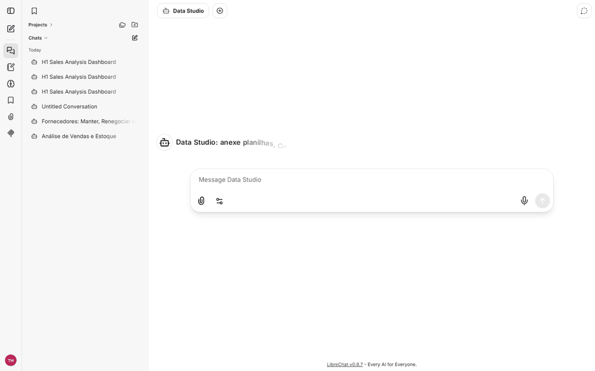
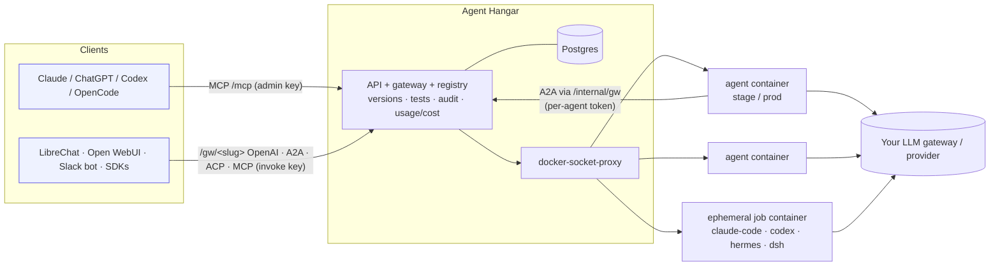

<div align="center">

# ⌂ Agent Hangar

**The self-hosted control plane for AI agents.**
Build agents by chatting from Claude, ChatGPT, Codex or OpenCode · test them in stage · ship each one to an
isolated container · use them anywhere via **OpenAI-compatible, A2A, ACP and MCP**.

[](https://github.com/valteresj2/agent-hangar/actions/workflows/ci.yml)
[](LICENSE)


[Quickstart](#quickstart) · [Why](#why) · [How it works](#how-it-works) · [Templates](#templates) · [Docs](docs/) · [Roadmap](ROADMAP.md) · [Português](README.pt-BR.md)

</div>

<p align="center"></p>

> **Status: alpha (v0.2).** It works end-to-end and is covered by tests, but APIs may still change. Run it
> inside your network, not on the open internet, until you have read [docs/security.md](docs/security.md).

---

## What it does

You connect Agent Hangar's MCP server to the AI client you already use and say:

> *"Create an agent that answers questions about our travel policy, test it and put it in production."*

Your client calls the hangar's tools and does the rest: it registers the agent (name, objective, expected output),
writes its instructions, skills, tools and test cases, deploys it to a **stage** container, runs the tests,
records the result and, only if they pass, promotes it to **production**. From then on the agent is a
service with four standard endpoints. Plug it into LibreChat, Open WebUI, OpenCode, Claude Desktop, a Slack bot,
another agent (A2A), or any OpenAI SDK. Each agent is also its **own MCP server**, so its skills and tools keep
working inside other AI tools.

## Quickstart

Requirements: Docker (Desktop or Engine) with Compose v2.

```bash
git clone https://github.com/valteresj2/agent-hangar && cd agent-hangar
./scripts/setup.sh              # Windows: powershell -File scripts/setup.ps1  → generates .env with random secrets
docker compose up -d --build    # hangar + Postgres + agent runtime + mock harness
```

Open **http://localhost:8090** and paste the `ADMIN_TOKEN` from `.env`. Go to **Templates → Document Q&A →
Apply + ship**. It runs in mock mode without any API key, so you can watch the whole flow. Then add a provider
under **Providers** (LiteLLM, OpenRouter, OpenAI, Anthropic, DeepSeek, Gemini, Ollama…) and point the agent at it.

Connect your AI client to the hangar (use an **admin** API key from *API keys*):

```bash
claude mcp add --transport http agent-hangar http://localhost:8090/mcp --header "Authorization: Bearer <key>"
```

Then just ask for an agent. More clients (Claude Desktop, Codex, OpenCode, ChatGPT) are covered in
[docs/clients.md](docs/clients.md).

> Coding harnesses (Claude Code, Codex, DeepSeek Harness, Hermes) are big images, so they are opt-in:
> `docker compose --profile harness build` (and `--profile hermes`).

## Why

- **Agents are built where people already work.** No new builder UI to learn: the hangar is an MCP server, so
  Claude, ChatGPT, Codex or OpenCode *are* the builder. The hangar's instructions tell the model how to choose
  between a chat agent, a coding harness or a multi-agent team based on the objective.
- **Nothing reaches production untested.** Every change creates an immutable version. Promotion to prod is
  blocked unless that exact version passed its stage tests: protocol smoke tests, `expect_contains`/`regex`, and
  **LLM-as-judge** rubrics. Rollback is one click (or `hangar rollback`).
- **One container per agent, one container per job.** Chat agents run in hardened containers (read-only FS,
  all capabilities dropped, memory/CPU/PID limits). Coding harnesses run in a **fresh ephemeral container per
  call** that is destroyed afterwards, with the result and the `git diff` returned.
- **Speak every protocol.** Each agent answers on OpenAI-compatible `/v1/chat/completions`, **A2A**
  (`message/send` + Agent Card), **ACP** and **MCP**, all behind one authenticated gateway with per-channel metrics.
- **Bring your own LLM gateway.** The hangar never hosts a model. Agents call your LiteLLM / OpenRouter /
  provider through *connections* (URL + model + virtual key, encrypted at rest), with per-environment overrides and
  cost tracking in US$.
- **Governed like software.** Scoped API keys (admin vs. invoke-only-these-agents), per-agent internal tokens,
  audit log, GitOps (`hangar apply -f agents.yaml`), JSON Schema for the spec.

## How it works



| Concept | In one line |
|---|---|
| **Agent** | Name + objective + expected output + a versioned **spec** (instructions, skills, MCPs, tools, sub-agents, tests) |
| **Chat agent** | An LLM loop with tools, always on, in its own container |
| **Harness agent** | Delegates each task to Claude Code / Codex / Hermes / DeepSeek Harness in a throwaway container |
| **Multi-agent** | A chat agent with `sub_agents`: it delegates over A2A through the hangar (which checks it is allowed) |
| **Connection** | External LLM endpoint + default model + key (encrypted) + optional price, protocol `openai`/`anthropic`/`deepseek` |
| **Stage → prod** | `ship` = deploy stage → run tests → record → promote only if green |

Details: [concepts](docs/concepts.md) · [spec reference](docs/spec.md) · [harnesses](docs/harnesses.md) ·
[API](docs/api.md) · [CLI](docs/cli.md) · [security](docs/security.md).

## Templates

| Template | Type | What it shows |
|---|---|---|
| `doc-qa` | chat | Grounded Q&A over a document with citations and refusal to invent |
| `platform-dashboard` | chat + builtin tool | An ops agent that reads the hangar's own live metrics |
| `ticket-triage` | chat | Structured JSON classification + first reply, regex + judge tests |
| `sql-analyst` | chat (+ your DB MCP) | Read-only SQL generation with safety rules |
| `code-fixer` | harness (Codex) | Fix code in an ephemeral container, returns a diff |
| `data-studio` | chat + Data Studio MCP | Python/DuckDB analyst: reads spreadsheets, PDFs and images, edits data, builds dashboards and PPTX/HTML decks. Powers LibreChat out of the box |
| `research-team` | multi-agent | Orchestrator + researcher + critic + writer over A2A |

`hangar templates apply doc-qa --connection my-litellm` or **Templates** in the UI. Templates are plain YAML in
[`templates/`](templates/), and they are the easiest way to contribute.

## Use a shipped agent

```bash
# create a key that can only call this agent
hangar keys create librechat --scope invoke --agent doc-qa

curl http://localhost:8090/gw/doc-qa/v1/chat/completions \
  -H "Authorization: Bearer ah_..." -H "Content-Type: application/json" \
  -d '{"model":"doc-qa","messages":[{"role":"user","content":"What is the hotel limit?"}]}'
```

| Protocol | Endpoint |
|---|---|
| OpenAI-compatible | `POST /gw/<slug>/v1/chat/completions` (streaming supported) |
| A2A | `GET /gw/<slug>/.well-known/agent.json`, `POST /gw/<slug>/a2a` |
| ACP | `POST /gw/<slug>/acp/runs` |
| MCP | `POST /gw/<slug>/mcp` (one tool named after the agent) |

**Teams and SSO:**
- People sign in with Google, Microsoft Entra ID, GitHub or any OAuth2 provider.
- Every agent belongs to a team with maintainer, developer and consumer roles.
- Production needs a second maintainer's approval.
- Other teams find agents in the company catalog and request access.
- SCIM keeps users and groups in sync with your directory.

See [docs/access.md](docs/access.md).

**230+ prebuilt MCP servers:** turn on servers from Docker's official MCP catalog (search, web fetch,
Wikipedia, GitHub, Postgres, Notion…). Each runs in an isolated container, and agents use them as
`docker:<name>`. See [docs/mcp-catalog.md](docs/mcp-catalog.md).

**Remote MCPs with OAuth and Activepieces:** connect OAuth-protected MCP servers (Activepieces with 280+ business
apps, Notion, Linear…) once. Agents use them through the central, which keeps and refreshes the tokens. See
[docs/remote-mcp.md](docs/remote-mcp.md).

**Plug and play:** the agent's **Connect** tab (or `hangar connect <slug> <tool>`) gives a per-tool key and the
config to paste. Every tool can use the agent as an **MCP tool** (Claude Code, Claude Desktop, Codex, OpenCode,
Cursor, VS Code, LibreChat, Open WebUI); chat UIs can also use it as a **model** (LibreChat, Open WebUI, OpenCode,
OpenAI SDKs). Each connection is optional and can be revoked alone. See [docs/clients.md](docs/clients.md).

Use `/gw-stage/<slug>/…` to talk to the stage version. Send `X-Channel: slack` (or any name) to get per-channel metrics.

## Data Studio + LibreChat

A complete example of an agent as the **engine behind a chat UI**. [LibreChat](https://librechat.ai) talks to the
`data-studio` agent through the OpenAI-compatible gateway. Each conversation gets its own workspace and Python kernel
in the [Data Studio MCP server](mcp-servers/data-studio/):
- Attached spreadsheets, PDFs and images are saved there automatically.
- The agent answers with verified numbers and links to generated **dashboards (HTML)**, **presentations (PPTX with
  native charts + HTML)**, **edited spreadsheets** and **reports (DOCX)**.

```bash
docker compose --profile data-studio up -d --build
hangar templates apply data-studio --connection <conn> && hangar ship data-studio
cd integrations/librechat && ./setup.sh && docker compose up -d     # http://localhost:3090
```

See [integrations/librechat](integrations/librechat/) for how the pieces connect and why this is the recommended
integration.

| Answer in LibreChat (tools stream live into a collapsible "Thoughts" block) | Generated dashboard | Generated deck (PPTX + HTML) |
|---|---|---|
|  |  |  |

`python scripts/demo/record_demo.py` regenerates the GIF and these screenshots (Playwright).

## CLI and GitOps

```bash
pip install ./cli
hangar login http://localhost:8090 --token <admin key>
hangar apply -f examples/agents.yaml --ship
hangar jobs run code-fixer "Add input validation to parse_date()" --follow
```

See [docs/cli.md](docs/cli.md).

## Project status and roadmap

v0.1 is the first public cut. Next up: Kubernetes/Helm, OpenTelemetry + Langfuse traces, Slack/Teams adapters,
OIDC/RBAC, egress allowlists for jobs, human approval, budgets. See [ROADMAP.md](ROADMAP.md) and the issues.

## Contributing

Issues and PRs are welcome. Templates, harness adapters and docs are great first contributions. Read
[CONTRIBUTING.md](CONTRIBUTING.md). Security reports: [SECURITY.md](SECURITY.md).

## License

[Apache-2.0](LICENSE).
