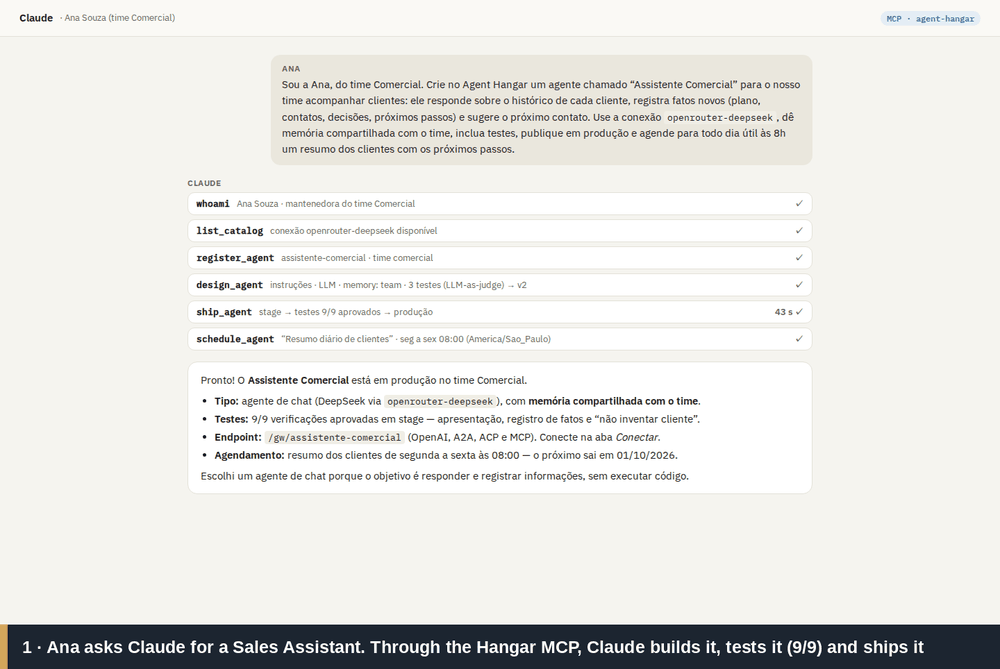
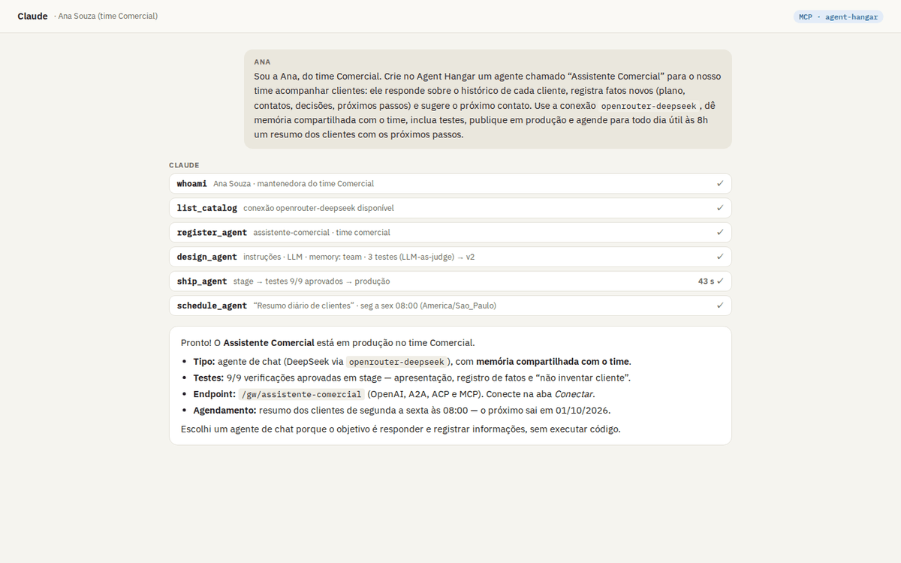
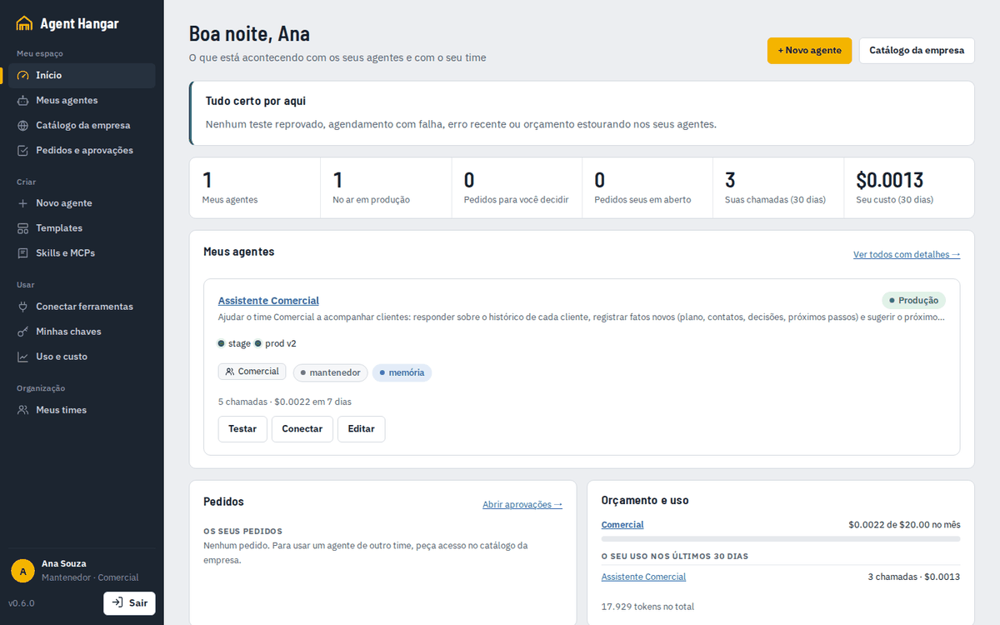
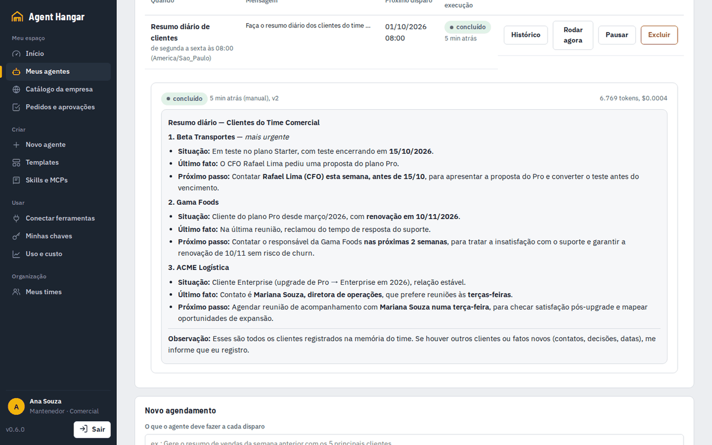

<div align="center">

# ⌂ Agent Hangar

**O plano de controle self-hosted para agentes de IA.**
Crie agentes conversando no Claude, ChatGPT, Codex ou OpenCode, teste em stage, publique cada um num container
isolado e use em qualquer lugar via **OpenAI-compatible, A2A, ACP e MCP**.

[English](README.md) · [Documentação](docs/) · [Roadmap](ROADMAP.md)

</div>

<p align="center"></p>
<p align="center"><sub>O portal do usuário, gravado numa instalação local · <a href="docs/assets/portal-tour.mp4">versão MP4</a></sub></p>

> **Status: alpha (v0.9).** Funciona de ponta a ponta e tem testes, mas as APIs ainda podem mudar. Rode dentro da
> sua rede até ler [docs/security.md](docs/security.md).

## Exemplo: do pedido no Claude ao agente funcionando

Uma execução real, numa instalação local. A Ana é mantenedora do time Comercial e **não** é admin. Ela conectou o
Claude ao MCP do Hangar com o token pessoal dela e pediu:

> *"Crie no Agent Hangar um agente chamado “Assistente Comercial” para o nosso time acompanhar clientes (…). Use a
> conexão openrouter-deepseek, dê memória compartilhada com o time, inclua testes, publique em produção e agende
> para todo dia útil às 8h um resumo dos clientes com os próximos passos."*

**O Claude construiu o agente pelas ferramentas do MCP.**
1. `whoami` e `list_catalog`.
2. `register_agent`.
3. `design_agent`, com instruções, LLM, `memory: {scope: team}` e 3 testes com LLM como juiz.
4. `ship_agent`: stage, **9/9 verificações aprovadas** e produção, em 43 s.
5. `schedule_agent`: de segunda a sexta às 08:00.

**O time usou o agente.**
- A Ana registrou as novidades dos clientes, e o agente gravou cada uma na **memória do time**.
- Numa conversa nova, o agente respondeu quem precisa de contato na semana.
- O **resumo diário agendado** é o resultado final: a Beta Transportes é a mais urgente (o teste acaba em 15/10 e
  o CFO pediu proposta do Pro), seguida da Gama Foods (renovação em 10/11 e reclamação do suporte).

| Pedido no Claude | Início da Ana | Resumo diário agendado |
|---|---|---|
|  |  |  |

Os detalhes estão no [README em inglês](README.md#from-a-request-in-claude-to-a-working-agent). Os scripts que
reproduzem a demo estão em [scripts/demo/portal-tour](scripts/demo/portal-tour/).

**Dois apps web:**
- **`/app/`** é o portal do usuário, para quem não é admin. Tem a página Início, os seus agentes, o catálogo, os
  pedidos, as chaves e os times.
- **`/ui/`** é o console de administração, só para admins.
- O login é o mesmo, e cada pessoa cai no lugar certo.

## O que faz

Você conecta o MCP do Agent Hangar ao cliente de IA que já usa e pede:

> *"Crie um agente que responde perguntas sobre nossa política de viagens, teste e coloque em produção."*

O cliente chama as ferramentas do hangar e faz o resto:

1. Registra o agente (nome, objetivo, saída esperada).
2. Escreve instruções, skills, tools e casos de teste.
3. Faz deploy num container de **stage** e roda os testes.
4. Registra o resultado e só promove para **produção** se os testes passarem.

A partir daí o agente é um serviço com quatro endpoints padrão. Você pode plugá-lo no LibreChat, no Open WebUI, no
OpenCode, no Claude Desktop, num bot de Slack, em outro agente (via A2A) ou em qualquer SDK da OpenAI. Cada agente
também é **um servidor MCP próprio**, então as skills e tools dele continuam funcionando dentro de outras
ferramentas.

**Times e SSO:**
- Cada pessoa entra com Google, Microsoft Entra ID, GitHub ou outro provedor OAuth2.
- Cada agente pertence a um time, com os papéis mantenedor, developer e consumer.
- Produção exige a aprovação de outro mantenedor.
- Os outros times encontram agentes no catálogo da empresa e pedem acesso.
- O SCIM sincroniza usuários e grupos com o diretório.

Veja [docs/access.md](docs/access.md).

**Plug and play:** na aba **Conectar** do agente (ou `hangar connect <slug> <ferramenta>`) você escolhe a
ferramenta e o modo, e recebe uma chave só daquela ferramenta com a configuração pronta para colar. Toda ferramenta
pode usar o agente **via MCP** (Claude Code, Claude Desktop, Codex, OpenCode, Cursor, VS Code, LibreChat, Open WebUI);
as de chat também podem usá-lo **como modelo** (LibreChat, Open WebUI, OpenCode, SDKs OpenAI). Cada conexão é
opcional e pode ser revogada sozinha.

## Início rápido

```bash
git clone https://github.com/valteresj2/agent-hangar && cd agent-hangar
./scripts/setup.sh              # Windows: powershell -File scripts/setup.ps1  → gera o .env com segredos aleatórios
docker compose up -d --build
```

Abra **http://localhost:8090** e cole o `ADMIN_TOKEN` do `.env`. Em **Templates → Document Q&A**, clique em
**Aplicar + shipar**. Sem nenhuma chave, o agente roda em modo mock, o que basta para ver o fluxo completo. Depois
cadastre um provedor em **Provedores** (LiteLLM, OpenRouter, OpenAI, Anthropic, DeepSeek, Gemini, Ollama…).

Para conectar seu cliente, gere uma chave **admin** em *Chaves de API* e rode:

```bash
claude mcp add --transport http agent-hangar http://localhost:8090/mcp --header "Authorization: Bearer <chave>"
```

Harnesses de código são opcionais porque as imagens são grandes:
- `docker compose --profile harness build` para Claude Code, Codex e DeepSeek Harness;
- `docker compose --profile hermes build` para o Hermes.

## Por quê

- **Agentes são criados onde as pessoas já trabalham.** O hangar é um servidor MCP, então o próprio
  Claude/ChatGPT/Codex vira o "builder". Ele escolhe entre agente de chat, harness de código ou multiagente a partir
  do objetivo.
- **Nada chega à produção sem teste.** Cada mudança gera uma versão imutável, e a promoção exige que essa versão
  tenha passado nos testes de stage. Os testes combinam smoke dos protocolos, `expect_contains`/`regex` e
  **LLM-as-judge**. O rollback é um clique.
- **Um container por agente e um por job.** Agentes de chat rodam em containers endurecidos. Harnesses (Claude
  Code, Codex, Hermes, DeepSeek Harness) sobem **um container efêmero por chamada** e devolvem o resultado e o
  `git diff`.
- **Todos os protocolos.** Cada agente expõe OpenAI-compatible, **A2A**, **ACP** e **MCP** atrás de um gateway
  autenticado, com métricas por canal.
- **Use o seu gateway de LLM.** O hangar nunca hospeda modelo: os agentes chamam o seu LiteLLM, OpenRouter ou
  provedor por meio de *conexões*. As chaves ficam criptografadas, há override por ambiente e o custo é calculado
  em US$.
- **Governado como software.** Chaves com escopo (admin × invoke só de certos agentes), tokens internos por
  agente, auditoria, GitOps (`hangar apply -f agents.yaml`) e JSON Schema da spec.

## Data Studio + LibreChat

Exemplo completo de agente como **motor de uma interface de chat**:
- O LibreChat conversa com o agente `data-studio`.
- Cada conversa ganha um workspace próprio, com Python e DuckDB.
- Os anexos (planilhas, PDFs, imagens) são gravados lá automaticamente.
- O agente devolve dashboards HTML, apresentações PPTX/HTML, planilhas editadas e relatórios, como links.

Veja [integrations/librechat](integrations/librechat/).

## Documentação

[Conceitos](docs/concepts.md) · [Referência da spec](docs/spec.md) · [Harnesses](docs/harnesses.md) ·
[API](docs/api.md) · [CLI](docs/cli.md) · [Clientes](docs/clients.md) · [Templates](docs/templates.md) ·
[Segurança](docs/security.md)

## Licença

[Apache-2.0](LICENSE).
